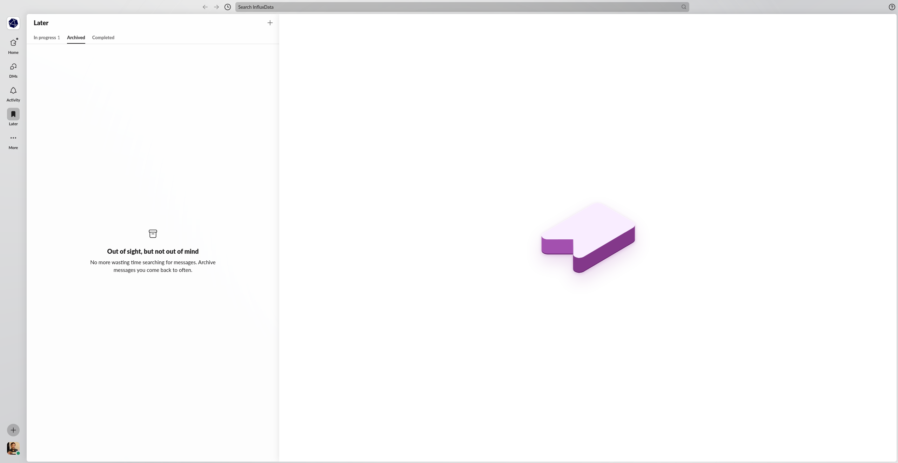
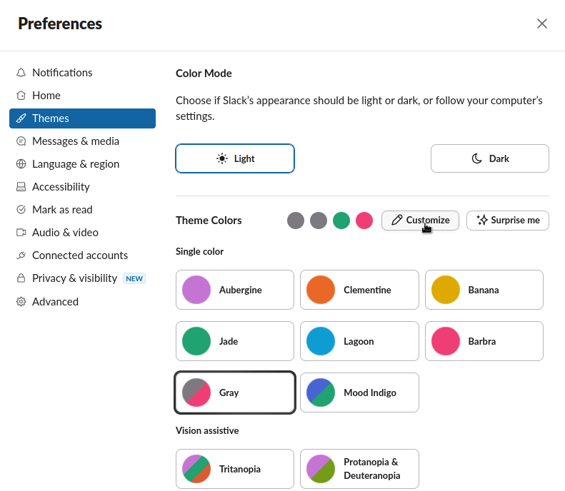
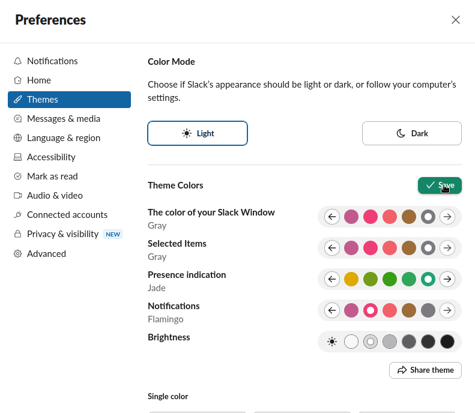
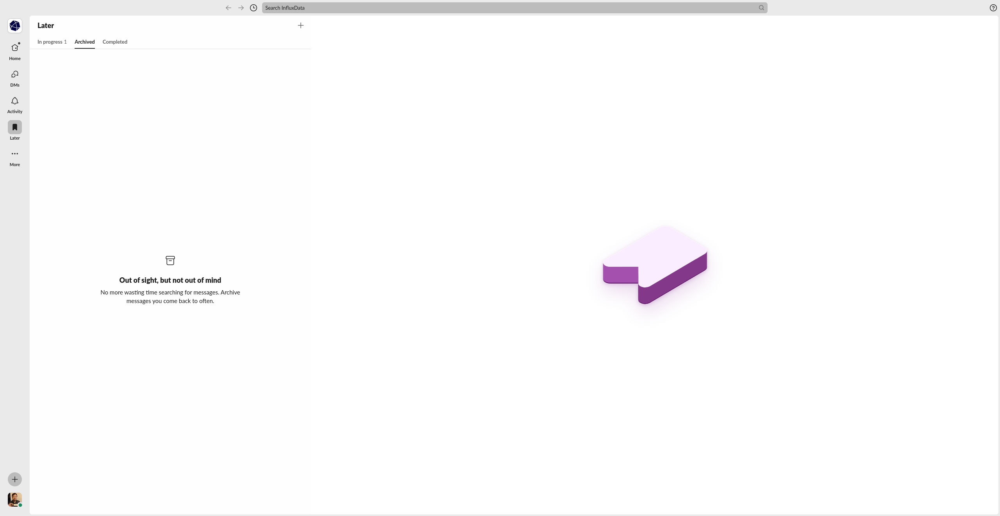

# Calm Slack
Different tools to calm down [Slack Web].


## Slack Notification Debouncer
A debouncer for [Slack Web] notifcations.

If you are using [Slack] on desktop, you may know the pain: a notification for EVERY SINGLE new message. This can be
especially annoying threads with heated discussions or for private conversations with people who hit ENTER after every
second word. Disabling notifcations may not be a good option either.

So why not _debounce_ notifcations -- i.e. only notify you for a new message if the last notification for the same
thread/conversations was at least X seconds ago? This [Userscript] implements that.

### Usage
This was tested with [Tampermonkey] and [Firefox]. Install [Tampermonkey] and create a new script and import
[`debounce_slack.js`](debounce_slack.js). Then enable the script. The [Tampermonkey] menu in your status bar also
provides a button to configure the debounce time:


## Gradient-Free Redesign
In 2023 [Slack] introduced a [Redesign]. I personally find the design rather meh, especially all these gradients make
it look like Windows Vista or some iPhone:



There is to be [no intended way](https://www.reddit.com/r/Slack/comments/16gqbfs/how_to_remove_the_gradient/) to fix that.
However you can somehow get it very close by using a custom theme:





You can make it even flatter using some cosmetic filters. For that, install [uBlock Origin], open the plugin settings,
go to "Filter lists" and right at the bottom you can provide a custom URL for a filter list. Use:

```text
https://raw.githubusercontent.com/crepererum/calm-slack/main/calm_slack.txt
```

After that, your [Slack Web] should look like this:




## License

Licensed under either of these:

 * Apache License, Version 2.0 ([LICENSE-APACHE](LICENSE-APACHE) or <https://www.apache.org/licenses/LICENSE-2.0>)
 * MIT License ([LICENSE-MIT](LICENSE-MIT) or <https://opensource.org/licenses/MIT>)

### Contributing

Unless you explicitly state otherwise, any contribution you intentionally submit for inclusion in the work, as defined
in the Apache-2.0 license, shall be dual-licensed as above, without any additional terms or conditions.


[Firefox]: https://www.mozilla.org/en-US/firefox/
[Redesign]: https://slack.com/blog/productivity/a-redesigned-slack-built-for-focus
[Slack]: https://slack.com/
[Slack Web]: https://app.slack.com/client/
[Tampermonkey]: https://www.tampermonkey.net/
[uBlock Origin]: https://ublockorigin.com/
[Userscript]: https://en.wikipedia.org/wiki/Userscript
