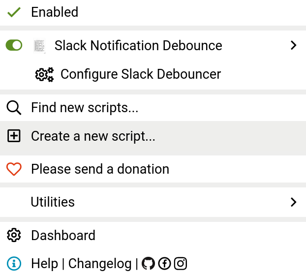

# Slack Notification Debouncer
A debouncer for [Slack Web] notifcations.

If you are using [Slack] on desktop, you may know the pain: a notification for EVERY SINGLE new message. This can be
especially annoying threads with heated discussions or for private conversations with people who hit ENTER after every
second word. Disabling notifcations may not be a good option either.

So why not _debounce_ notifcations -- i.e. only  notify you for a new message if the last notification for the same
thread/conversations was at least X seconds ago? This [Userscript] implements that.

## Usage
This was tested with [Tampermonkey] and [Firefox]. Install [Tampermonkey] and create a new script and import
[`debounce_slack.js`](debounce_slack.js). Then enable the script. The [Tampermonkey] menu in your status bar also
provides a button to configure the debounce time:

## License

Licensed under either of these:

 * Apache License, Version 2.0 ([LICENSE-APACHE](LICENSE-APACHE) or <https://www.apache.org/licenses/LICENSE-2.0>)
 * MIT License ([LICENSE-MIT](LICENSE-MIT) or <https://opensource.org/licenses/MIT>)

### Contributing

Unless you explicitly state otherwise, any contribution you intentionally submit for inclusion in the work, as defined
in the Apache-2.0 license, shall be dual-licensed as above, without any additional terms or conditions.

[Firefox]: https://www.mozilla.org/en-US/firefox/
[Slack]: https://slack.com/
[Slack Web]: https://app.slack.com/client/
[Tampermonkey]: https://www.tampermonkey.net/
[Userscript]: https://en.wikipedia.org/wiki/Userscript
